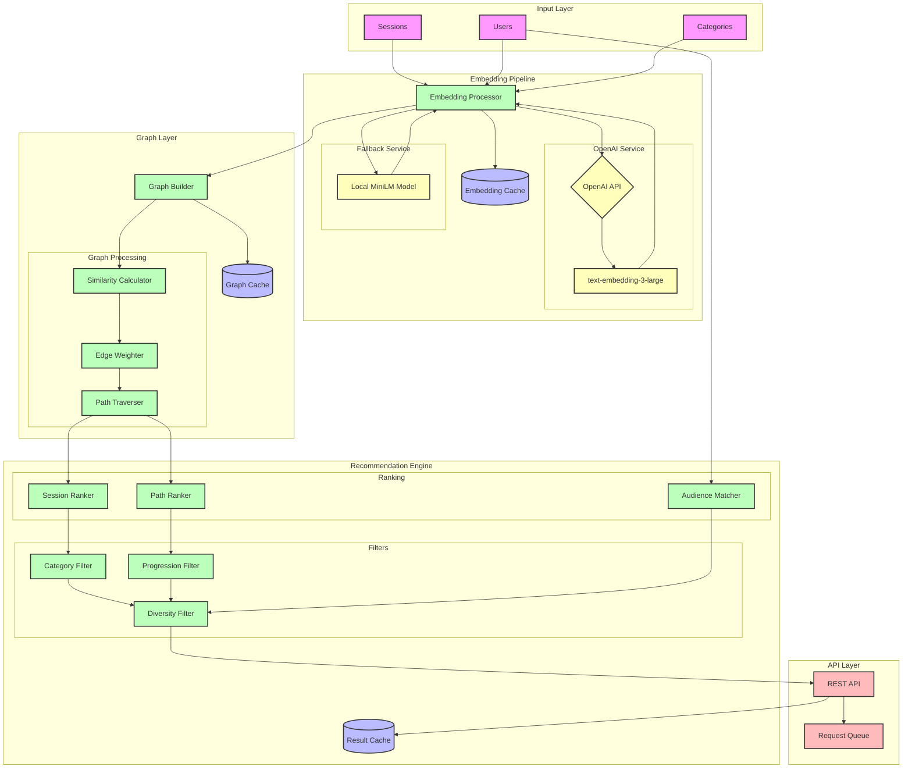

```mermaid
flowchart TB
    subgraph Input Layer
        S[Sessions]
        U[Users]
        C[Categories]
    end

    subgraph Embedding Pipeline
        direction TB
        EP[Embedding Processor]
        EC[(Embedding Cache)]

        subgraph OpenAI Service
            OAI{OpenAI API}
            EM[text-embedding-3-large]
        end

        subgraph Fallback Service
            FM[Local MiniLM Model]
        end
    end

    subgraph Graph Layer
        direction TB
        GB[Graph Builder]
        GC[(Graph Cache)]

        subgraph Graph Processing
            CS[Similarity Calculator]
            EW[Edge Weighter]
            PT[Path Traverser]
        end
    end

    subgraph Recommendation Engine
        direction TB
        RC[Recommendation Controller]

        subgraph Ranking
            SR[Session Ranker]
            PR[Path Ranker]
            AR[Audience Matcher]
        end

        subgraph Filters
            CF[Category Filter]
            PF[Progression Filter]
            DF[Diversity Filter]
        end
    end

    subgraph API Layer
        API[REST API]
        RQ[Request Queue]
        RC[(Result Cache)]
    end

    %% Connections
    S --> EP
    U --> EP
    C --> EP

    EP --> OAI
    OAI --> EM
    EM --> EP
    EP --> EC

    EP --> FM
    FM --> EP

    EP --> GB
    GB --> GC

    GB --> CS
    CS --> EW
    EW --> PT

    PT --> SR
    PT --> PR
    U --> AR

    SR --> CF
    PR --> PF
    CF --> DF
    PF --> DF
    AR --> DF

    DF --> API
    API --> RQ
    API --> RC

    %% Styling
    classDef input fill:#f9f,stroke:#333,stroke-width:2px
    classDef processor fill:#bfb,stroke:#333,stroke-width:2px
    classDef storage fill:#bbf,stroke:#333,stroke-width:2px
    classDef api fill:#fbb,stroke:#333,stroke-width:2px
    classDef service fill:#ffb,stroke:#333,stroke-width:2px

    class S,U,C input
    class EP,GB,CS,EW,PT,SR,PR,AR,CF,PF,DF processor
    class EC,GC,RC storage
    class API,RQ api
    class OAI,EM,FM service
```
