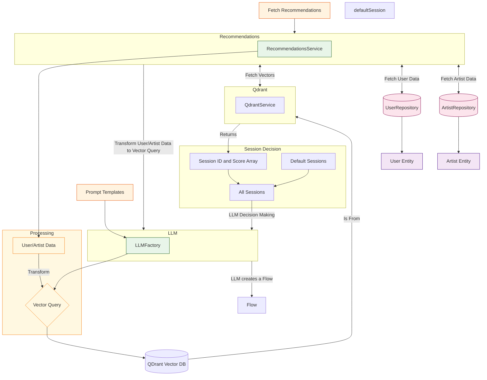

```mermaid
graph TD
    %% Main Module
    subgraph Recommendations
      RecService[RecommendationsService]
    end

    %% Qdrant Module
    subgraph Qdrant
      QdService[QdrantService]
    end

    %% LLM Module
    subgraph LLM
      LLMFactory[LLMFactory]
    end

    %% Databases
    UserRepo[(UserRepository)]
    ArtistRepo[(ArtistRepository)]
    qdrant[(QDrant Vector DB)]

    %% Handlers and Components
    TickHandler[Fetch Recommendations]
    Prompts[Prompt Templates]

    %% Entities
    UserEntity[User Entity]
    ArtistEntity[Artist Entity]

    %% Module Dependencies
    Recommendations --> |Transform User/Artist Data to Vector Query| LLM
    Recommendations <--> |Fetch Vectors| Qdrant

    %% Data Flow
    Recommendations <--> |Fetch User Data| UserRepo
    Recommendations <--> |Fetch Artist Data| ArtistRepo

    %% QDrant query
    LLMFactory --> VectorQuery{Vector Query}
    Prompts --> LLMFactory
    VectorQuery --> qdrant
    qdrant --> |Is From| Qdrant
    Qdrant --> |Returns| recommendedSessions[Session ID and Score Array]

    %% Repository Dependencies
    UserRepo --> UserEntity
    ArtistRepo --> ArtistEntity

    %% Handler Dependencies
    TickHandler --> Recommendations

    %% Processing Steps
    subgraph Processing
        UserArtistData[User/Artist Data] --> |Transform| VectorQuery
    end

    %% Session Decision Pipeline
    defaultSessions[Default Sessions]
    allSessions[All Sessions]
    defaultSession
    subgraph Session Decision
        recommendedSessions --> allSessions
        defaultSessions --> allSessions
    end
    allSessions --> |LLM Decision Making| LLM
    LLM --> |LLM creates a Flow| Flow["Flow"]

    RecService --> UserArtistData

    %% Styling
    classDef module fill:#e1f5fe,stroke:#01579b
    classDef service fill:#e8f5e9,stroke:#1b5e20
    classDef repo fill:#fce4ec,stroke:#880e4f
    classDef entity fill:#f3e5f5,stroke:#4a148c
    classDef component fill:#fff3e0,stroke:#e65100
    classDef processing fill:#fff8e1,stroke:#f57f17

    class RecModule,LLMModule module
    class RecService,LLMFactory service
    class UserRepo,ArtistRepo,QDrant repo
    class UserEntity,ArtistEntity entity
    class TickHandler,Prompts,DTOs component
    class Processing,UserArtistData,VectorQuery processing

```
