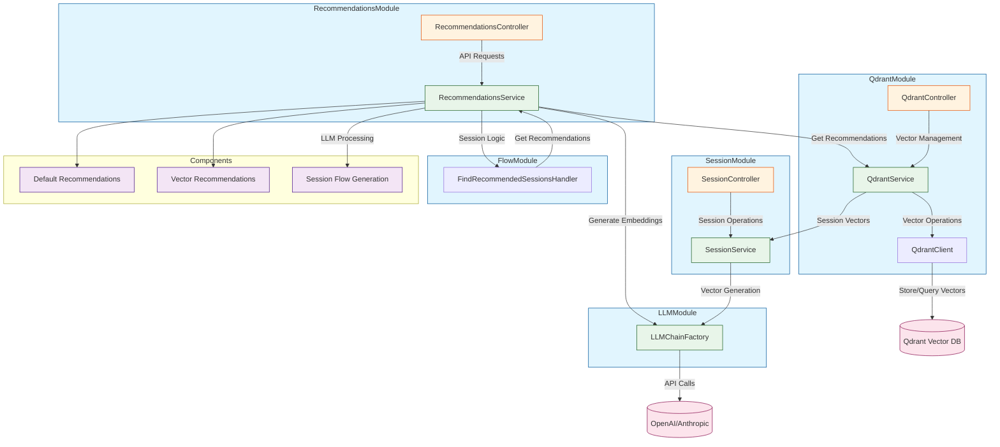

```mermaid
graph TD
    %% Main Modules
    subgraph RecommendationsModule
        RecService[RecommendationsService]
        RecController[RecommendationsController]
    end

    %% Qdrant Module
    subgraph QdrantModule
        QdService[QdrantService]
        QdController[QdrantController]
        QdClient[QdrantClient]
    end

    %% Session Module
    subgraph SessionModule
        SessionService[SessionService]
        SessionController[SessionController]
    end

    %% LLM Module
    subgraph LLMModule
        LLMFactory[LLMChainFactory]
    end

    %% Flow Module
    subgraph FlowModule
        FindRecHandler[FindRecommendedSessionsHandler]
    end

    %% External Services
    VectorDB[(Qdrant Vector DB)]
    LLMProvider[(OpenAI/Anthropic)]

    %% Data Flow - Recommendations
    RecController --> |API Requests| RecService
    RecService --> |Get Recommendations| QdService
    RecService --> |Generate Embeddings| LLMFactory
    RecService --> |Session Logic| FindRecHandler

    %% Data Flow - Qdrant
    QdService --> |Vector Operations| QdClient
    QdClient --> |Store/Query Vectors| VectorDB
    QdController --> |Vector Management| QdService

    %% Data Flow - Sessions
    SessionController --> |Session Operations| SessionService
    SessionService --> |Vector Generation| LLMFactory
    QdService --> |Session Vectors| SessionService

    %% LLM Operations
    LLMFactory --> |API Calls| LLMProvider
    
    %% Handler Flow
    FindRecHandler --> |Get Recommendations| RecService
    
    %% Key Components
    subgraph Components
        DefaultRecs[Default Recommendations]
        VectorRecs[Vector Recommendations]
        SessionFlow[Session Flow Generation]
    end

    RecService --> DefaultRecs
    RecService --> VectorRecs
    RecService --> |LLM Processing| SessionFlow

    %% Styling
    classDef module fill:#e1f5fe,stroke:#01579b
    classDef service fill:#e8f5e9,stroke:#1b5e20
    classDef controller fill:#fff3e0,stroke:#e65100
    classDef component fill:#f3e5f5,stroke:#4a148c
    classDef external fill:#fce4ec,stroke:#880e4f

    class RecommendationsModule,QdrantModule,SessionModule,LLMModule,FlowModule module
    class RecService,QdService,SessionService,LLMFactory service
    class RecController,QdController,SessionController controller
    class DefaultRecs,VectorRecs,SessionFlow component
    class VectorDB,LLMProvider external
```
