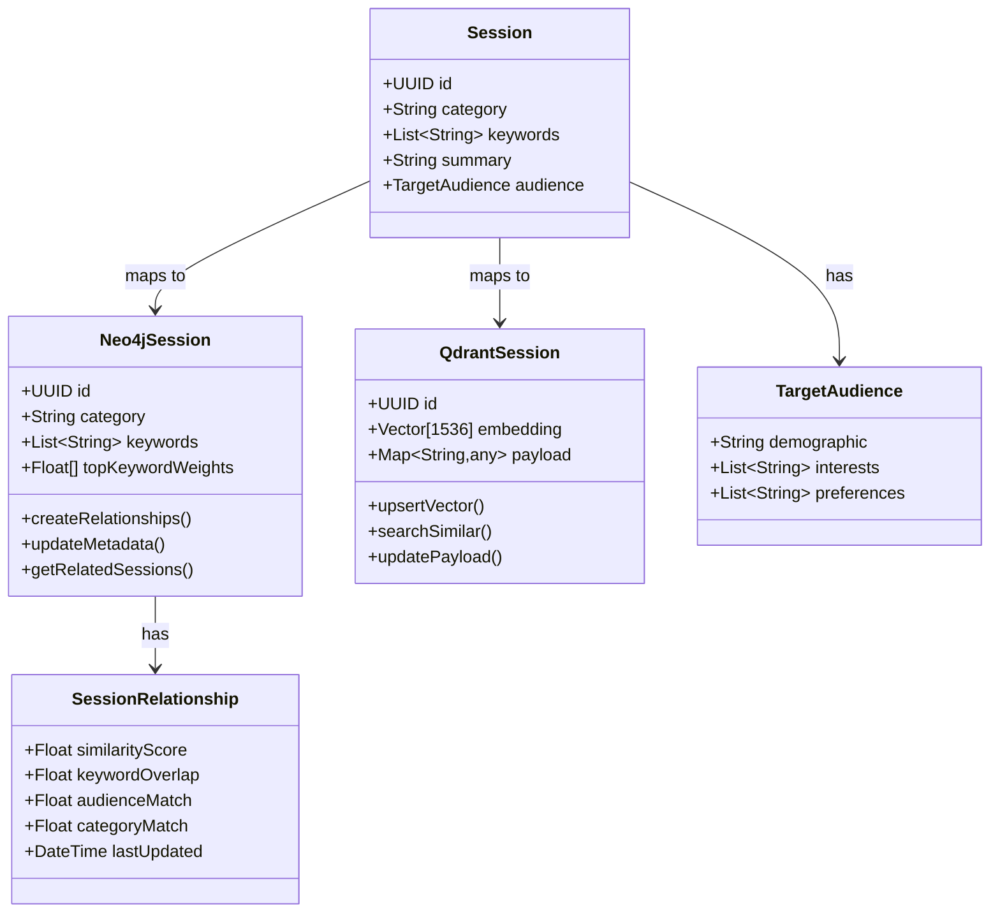

```mermaid
classDiagram
    class Session {
        +UUID id
        +String category
        +List~String~ keywords
        +String summary
        +TargetAudience audience
    }

    class Neo4jSession {
        +UUID id
        +String category
        +List~String~ keywords
        +Float[] topKeywordWeights
        +createRelationships()
        +updateMetadata()
        +getRelatedSessions()
    }

    class QdrantSession {
        +UUID id
        +Vector[1536] embedding
        +Map~String,any~ payload
        +upsertVector()
        +searchSimilar()
        +updatePayload()
    }

    class SessionRelationship {
        +Float similarityScore
        +Float keywordOverlap
        +Float audienceMatch
        +Float categoryMatch
        +DateTime lastUpdated
    }

    class TargetAudience {
        +String demographic
        +List~String~ interests
        +List~String~ preferences
    }

    Session --> Neo4jSession : maps to
    Session --> QdrantSession : maps to
    Neo4jSession --> SessionRelationship : has
    Session --> TargetAudience : has
```
