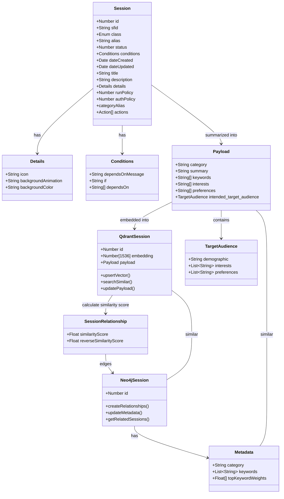

```mermaid
classDiagram
  class Session {
    +Number id
    +String sfid
    +Enum class
    +String alias
    +Number status
    +Conditions conditions
    +Date dateCreated
    +Date dateUpdated
    +String title
    +String description
    +Details details
    +Number runPolicy
    +Number authPolicy
    +categoryAlias
    +Action[] actions
  }

  Session --> Details: has

  class Details {
    +String icon
    +String backgroundAnimation
    +String backgroundColor
  }

  Session --> Conditions: has

  class Conditions {
    +String dependsOnMessage
    +String if
    +String[] dependsOn
  }

  Session --> Payload: summarized into

  class Payload {
    +String category
    +String summary
    +String[] keywords
    +String[] interests
    +String[] preferences
    +TargetAudience intended_target_audience
  }

  Payload --> QdrantSession: embedded into

  class QdrantSession {
    +Number id
    +Number[1536] embedding
    +Payload payload
    +upsertVector()
    +searchSimilar()
    +updatePayload()
  }

  Payload --> TargetAudience: contains

  class TargetAudience {
    +String demographic
    +List~String~ interests
    +List~String~ preferences
  }

  QdrantSession --> SessionRelationship: calculate similarity score

  class SessionRelationship {
    +Float similarityScore
    +Float reverseSimilarityScore
  }

  SessionRelationship --> Neo4jSession: edges

  class Neo4jSession {
    +Number id
    +createRelationships()
    +updateMetadata()
    +getRelatedSessions()
  }

  Neo4jSession --> Metadata: has

  class Metadata {
    +String category
    +List~String~ keywords
    +Float[] topKeywordWeights
  }

  Neo4jSession -- QdrantSession: similar
  Payload -- Metadata: similar
```
