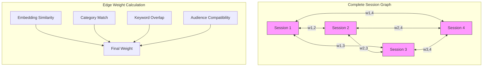

```mermaid
graph TB
    subgraph Complete Session Graph
        S1[Session 1]
        S2[Session 2]
        S3[Session 3]
        S4[Session 4]

        S1 <-- w1,2 --> S2
        S1 <-- w1,3 --> S3
        S1 <-- w1,4 --> S4
        S2 <-- w2,3 --> S3
        S2 <-- w2,4 --> S4
        S3 <-- w3,4 --> S4

        style S1 fill:#f9f,stroke:#333
        style S2 fill:#f9f,stroke:#333
        style S3 fill:#f9f,stroke:#333
        style S4 fill:#f9f,stroke:#333

        classDef edge-label fill:none,stroke:none
    end

    subgraph Edge Weight Calculation
        direction TB
        E1[Embedding Similarity]
        E2[Category Match]
        E3[Keyword Overlap]
        E4[Audience Compatibility]
        W[Final Weight]

        E1 --> W
        E2 --> W
        E3 --> W
        E4 --> W
    end
```
