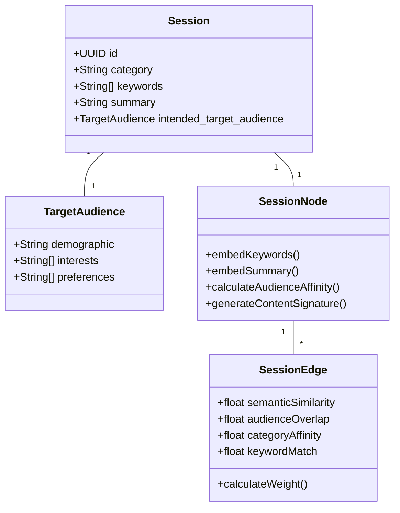

```mermaid
classDiagram
    class Session {
        +UUID id
        +String category
        +String[] keywords
        +String summary
        +TargetAudience intended_target_audience
    }

    class TargetAudience {
        +String demographic
        +String[] interests
        +String[] preferences
    }

    class SessionNode {
        +embedKeywords()
        +embedSummary()
        +calculateAudienceAffinity()
        +generateContentSignature()
    }

    class SessionEdge {
        +float semanticSimilarity
        +float audienceOverlap
        +float categoryAffinity
        +float keywordMatch
        +calculateWeight()
    }

    Session "1" -- "1" TargetAudience
    Session "1" -- "1" SessionNode
    SessionNode "1" -- "*" SessionEdge
```
