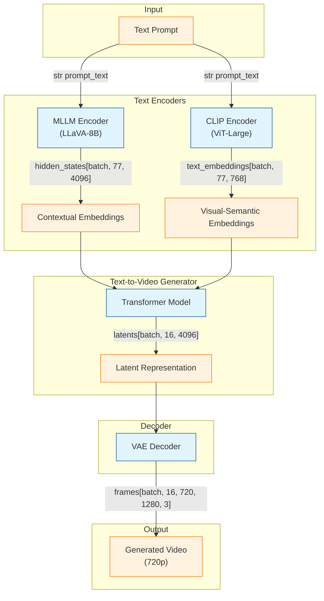

```mermaid
flowchart TB
    subgraph Input
        text[Text Prompt]
    end

    subgraph TextEncoders["Text Encoders"]
        mllm["MLLM Encoder\n(LLaVA-8B)"]
        clip["CLIP Encoder\n(ViT-Large)"]
        text -->|"str prompt_text"| mllm
        text -->|"str prompt_text"| clip
        mllm -->|"hidden_states[batch, 77, 4096]"| mllm_emb[Contextual Embeddings]
        clip -->|"text_embeddings[batch, 77, 768]"| clip_emb[Visual-Semantic Embeddings]
    end

    subgraph T2VGenerator["Text-to-Video Generator"]
        transformer["Transformer Model"]
        mllm_emb --> transformer
        clip_emb --> transformer
        transformer -->|"latents[batch, 16, 4096]"| latent[Latent Representation]
    end

    subgraph Decoder
        vae["VAE Decoder"]
        latent --> vae
    end

    subgraph Output
        video["Generated Video\n(720p)"]
        vae -->|"frames[batch, 16, 720, 1280, 3]"| video
    end

    classDef component fill:#e1f5fe,stroke:#01579b
    classDef data fill:#fff3e0,stroke:#ff6f00

    class mllm,clip,transformer,vae component
    class text,mllm_emb,clip_emb,latent,video data
```
