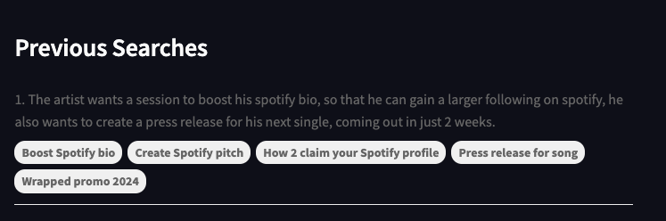

This is the aflow recommendation engine proof of concept.

This this is the main search engine, as of now, it does not search when you press enter, instead, press the `Get Recommendations` button to generate your recommendations. The recommendations will pop up as a stack of cards below the search engine.

On the right, your previous prompts are also saved, together with the top 5 sessions that was recommended, to ensure ease of tracking and testing.

