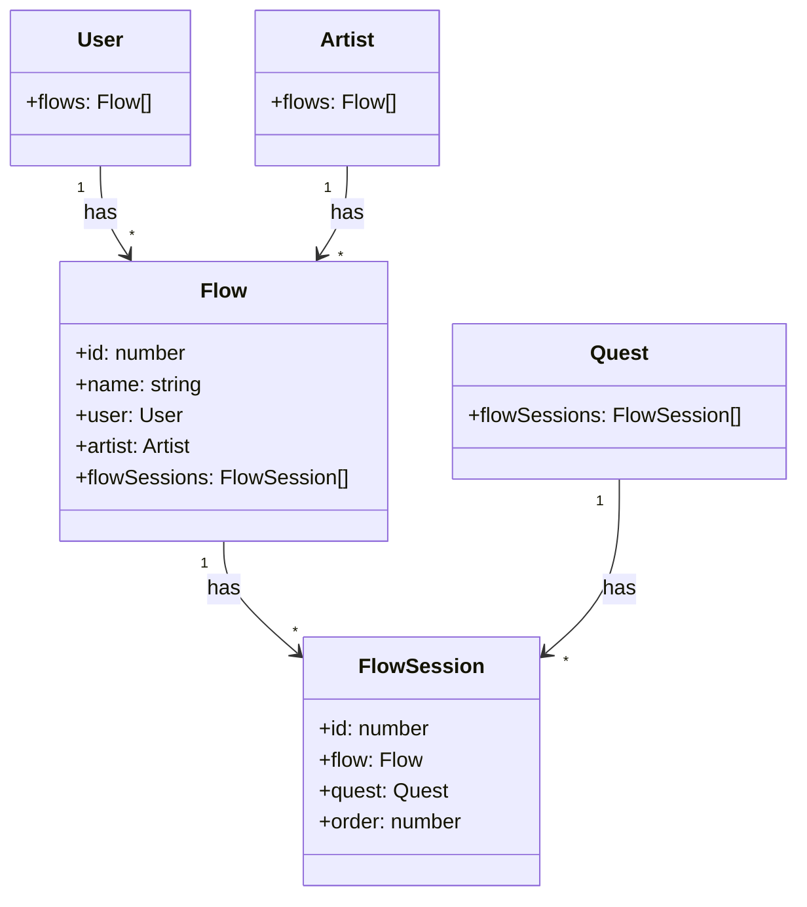

```mermaid
classDiagram
    class Flow {
        +id: number
        +name: string
        +user: User
        +artist: Artist
        +flowSessions: FlowSession[]
    }

    class FlowSession {
        +id: number
        +flow: Flow
        +quest: Quest
        +order: number
    }

    class User {
        +flows: Flow[]
    }

    class Artist {
        +flows: Flow[]
    }

    class Quest {
        +flowSessions: FlowSession[]
    }

    Flow "1" --> "*" FlowSession : has
    User "1" --> "*" Flow : has
    Artist "1" --> "*" Flow : has
    Quest "1" --> "*" FlowSession : has
```
