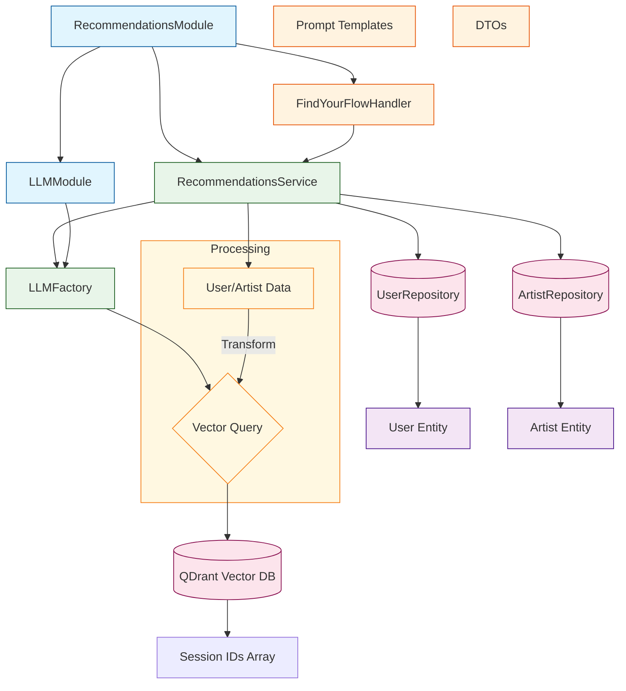

```mermaid

graph TD
    %% Main Module
    RecModule[RecommendationsModule]
    RecService[RecommendationsService]

    %% Dependencies
    LLMModule[LLMModule]
    LLMFactory[LLMFactory]
    QDrant[(QDrant Vector DB)]

    %% Repositories
    UserRepo[(UserRepository)]
    ArtistRepo[(ArtistRepository)]

    %% Handlers and Components
    TickHandler[FindYourFlowHandler]
    Prompts[Prompt Templates]
    DTOs[DTOs]

    %% Entities
    UserEntity[User Entity]
    ArtistEntity[Artist Entity]

    %% Module Dependencies
    RecModule --> RecService
    RecModule --> LLMModule
    RecModule --> TickHandler

    %% Data Flow
    RecService --> UserRepo
    RecService --> ArtistRepo
    RecService --> LLMFactory
    LLMFactory --> VectorQuery{Vector Query}
    VectorQuery --> QDrant
    QDrant --> SessionIDs[Session IDs Array]

    %% Repository Dependencies
    UserRepo --> UserEntity
    ArtistRepo --> ArtistEntity

    %% Handler Dependencies
    TickHandler --> RecService

    %% LLM Dependencies
    LLMModule --> LLMFactory

    %% Processing Steps
    subgraph Processing
        UserArtistData[User/Artist Data] --> |Transform| VectorQuery
    end

    RecService --> UserArtistData

    %% Styling
    classDef module fill:#e1f5fe,stroke:#01579b
    classDef service fill:#e8f5e9,stroke:#1b5e20
    classDef repo fill:#fce4ec,stroke:#880e4f
    classDef entity fill:#f3e5f5,stroke:#4a148c
    classDef component fill:#fff3e0,stroke:#e65100
    classDef processing fill:#fff8e1,stroke:#f57f17

    class RecModule,LLMModule module
    class RecService,LLMFactory service
    class UserRepo,ArtistRepo,QDrant repo
    class UserEntity,ArtistEntity entity
    class TickHandler,Prompts,DTOs component
    class Processing,UserArtistData,VectorQuery processing

```
